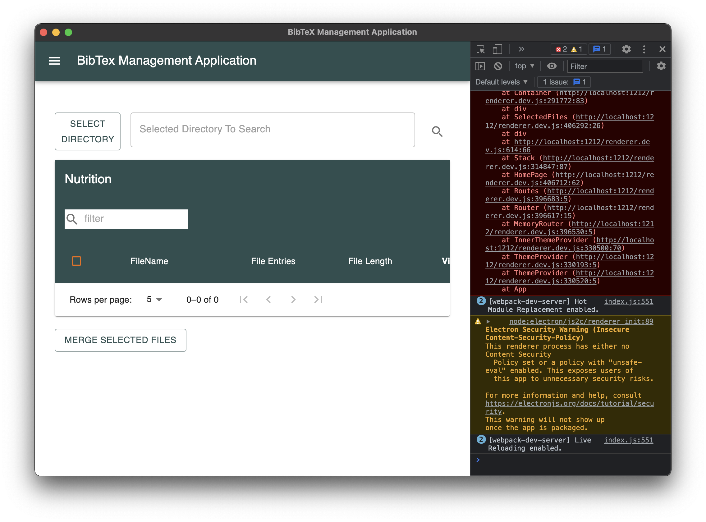

# CS4099 Project - BibTeX Management System
Built using [Neon Bindings](https://neon-bindings.com): a library for writing safe and fast native Node.js modules in Rust, and [Electron](https://www.electronjs.org).

### The Project
To develop a lightweight, fast desktop application for collating and merging `.bib` files on a volume. The application searches a directory and subdirectories for any `.bib` files, then merges them, using approximate string matching techniques to find duplicate or near-duplicate citations.

### Building and Running the Project
#### Backend Module
**This module must be built before the frontend can be ran**
`native` contains the npm module built using [Neon Bindings](https://neon-bindings.com) in Rust.
To build this module both `cargo` and `node`/`npm` are required.

Building the module can be done as follows
```
cd native
npm install
npm run build -- --release
```
To use the built module it can simply be imported as a node module once built. For example:
```
node
> require('.').levenshtein('pass', 'past')
1
```
**This module must be built before the frontend can be ran**
#### Frontend
`frontend` contains the code for building and running the GUI [Electron](https://www.electronjs.org) app.
To install dependencies for the frontend perform the following:
```
cd frontend
npm install
```
Then, to ensure the native module is installed
```
cd ./release/app
npm i ../../../native
```
To run the GUI. Run the following
```
npm run start
```
This should open a GUI in development mode, which will look something as follows


### Installing/Packaging the Project
Once the above steps are completed, the following commands can be ran to build and install the project (done from the `/frontend`).
```
npm run build
npm run package
```
This will build a compatable build for the local system. To build it specifically for an OS environment, this can be done with the following command
```
npm run package --[option]
# Example: npm run package -- --mac
```
This will create a packaged app which can be installed inside the `/release` directory

#### Testing scripts
To run testing scrips, navigate to the base directory and run `npm install`.
The two provided scripts can then be run as follows.
```
node ./algorithm_comparison_script.js
```
```
node ./test_script.js
```